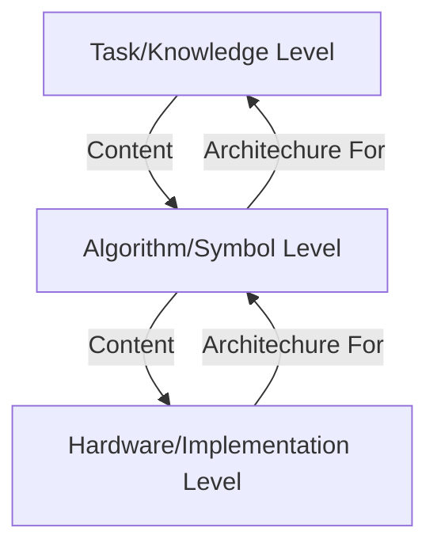
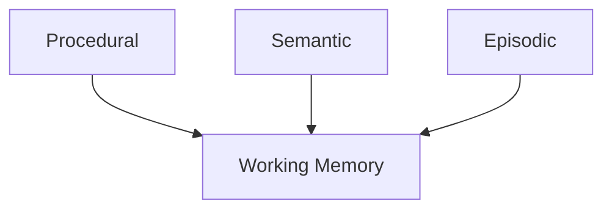

# Production Systems

## Introduction
Production systems are a type of **cognitive architecture** where knowledge is represented in the form of **rules**. These systems are used for **decision-making, problem-solving, and learning**.

This is the last topic in the fundamental topics section of the course. We will cover:
1. Cognitive architectures
2. Production systems
3. Learning through **chunking**

---

## Cognitive Architectures and Agents
### What is a Cognitive Agent?
A **cognitive agent** is an entity that maps **perceptual history** into **actions**:
- Example: A baseball pitcher deciding between different pitch types based on the game context.
- It asks what should I do next
- AI systems use cognitive architectures to make complex decisions.

### Levels of Abstraction
Cognitive architectures can be analyzed at **three levels**:
1. **Hardware Level** – The physical components (e.g., brain, computer processors).
2. **Algorithm Level** – The reasoning processes (e.g., means-end analysis, decision trees).
3. **Task/Knowledge Level** – The actual problem the agent is solving.

Task level is High Level 
Hardware is Low level

Architecture is used to implement the one above it
Content says what need to be represented in the algorithm 

eg. We represent things in semantic network (Algo level), but to find what we represent in the network is from the Task Level

Example: **IBM Watson**
- **Hardware Level**: Physical servers running Watson.
- **Algorithm Level**: Search and decision-making processes.
- **Task Level**: Answering Jeopardy! questions.

---

## Production Systems

### Assumptions
- **Goal Orientated** - They take action in pursuit of these goal
- **Rich, complex environment** 
- **Significant Knowledge** - Use knowledege of the world to pursue of the goal
- **Symbols and abstractions** - captures the important things in the world and removes the useless 
- **Flexible** - function of the environment
- **learning**- constantly learning

We can capture the intuition of Prod Sys by formula

Architecture + Content = Behavior

1. Imagine you want to design machine that shows a kind of behavior, this equations says you need to have the right architecture with the right knowledge content get the proper behavior 
2. Say we are trying understand human behavior, assuming the architecture is fixed we can say that this behavior arises because the knowledge content, this allows us map behavior to content. 

# Cognitive Architecture 
### SOAR 

**Procedural** - How to do something (pouring water)
**Semantic** - Generalization, and concepts (What is a human being)
**Episodic** - Events (what did u eat)

### Key Components
A **production system** consists of:
1. **Working Memory (WM)** – Stores the current state, percepts, and goals.
2. **Long-Term Memory (LTM)** – Contains procedural knowledge in the form of **production rules**. (Procedural, Semantic, Episodic)
3. **Production Rules** – If-then rules that map percepts to actions.

### Rule Matching and Execution
- **Rules are matched** with percepts from **working memory**.
- The **best matching rule is activated**.
- If multiple rules match, **conflicts are resolved**.

### Example: Baseball Pitcher Decision-Making
1. **Percepts**: The pitcher observes the game (inning, runners, score, batter).
2. **Goal**: Escape the inning without allowing runs.
3. **Production Rules**:

### Example 1
![[Screenshot 2025-02-21 at 1.43.26 PM.png]]

In this case SOAR would:
choose r1 (new goal walk the batter)
then go to r3(to suggest intentional-walk operator)
Then choose r7( send the operator to motor system)

### Example 2
![[Screenshot 2025-02-21 at 1.49.11 PM.png]]

In this case SOAR would:
choose r2 (make new goal get batter out via pitch)
then choose r4
then choose r5 throw curve ball
then r7 with operator curveball 

### Example 3

![[Screenshot 2025-02-21 at 1.53.56 PM.png]]

In this case SOAR would:

choose r2 (Suggest pitch)
then r4
then r5 (throw curve ball operator)
then r6 (throw fast ball operator)
chooses **none** (impasse)

### we need someway to force it to do one (chunking)
---

## Learning in Production Systems: Chunking
### What is Chunking?
**Chunking** is a learning mechanism used in SOAR-based production systems:
1. **An impasse occurs** when no rule provides a clear action (helps break it)
2. **The system retrieves past experiences** from episodic memory.
3. **A new rule is learned** to handle similar situations in the future.

### Example:
In the example 3 we can add r8 where
- A pitcher faces a left-handed batter, but no rule determines the best pitch.
- The system recalls a past event where a fastball led to a home run.
- A new rule is created: **IF batter is Parra, THEN avoid fastballs**.
 ![[Screenshot 2025-02-21 at 2.09.08 PM.png]]

---

## Applications in AI
### **Raven’s Progressive Matrices**
- Production systems **learn transformation rules** from given figures.
- Rules are applied to find the correct missing piece.
- Learning allows AI agents to adapt to **new problems dynamically**.

### **Cognitive Modeling**
- Production systems are **inspired by human cognition**.
- Working memory in AI mirrors **short-term memory** in humans.
- Some production systems behave similarly to humans in **arithmetic and algebra**.

---

## Strengths and Limitations
### Strengths:
✅ **Rule-based reasoning** makes decision-making transparent.  
✅ **Learning through chunking** allows adaptation.  
✅ **Efficient for structured problems** like math, logic, and board games.  

### Limitations:
❌ **Difficult to scale** for open-ended, real-world scenarios.  
❌ **Conflicts between rules** may require complex resolution mechanisms.  
❌ **Requires extensive knowledge encoding** for optimal performance.  

---

## Conclusion
Production systems form the foundation of many AI reasoning frameworks. They enable:
- **Decision-making** through rule-based logic.
- **Learning** via chunking.
- **Applications** in problem-solving, planning, and cognitive modeling.

These systems are closely tied to **human cognition** and are fundamental in AI research.

